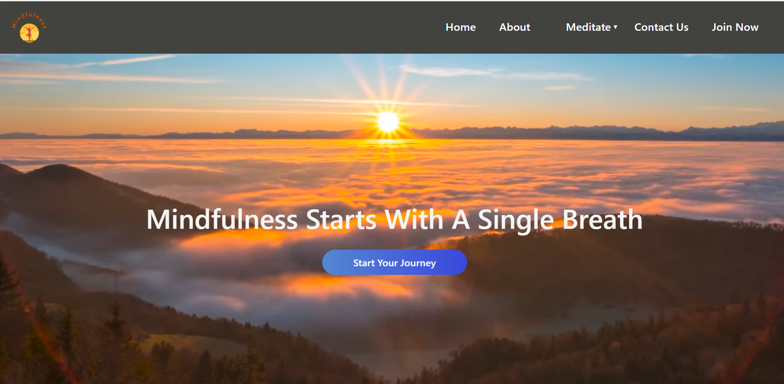

# 🎶 **Mindfulness Meditation Website** 🌿

**A peaceful digital space for meditation, relaxation, and mindfulness practice.** 
Designed to help you calm your mind, reduce stress, improve sleep, and reconnect with yourself.

---

## 🌐 **Live Demo**

🔗 [View the live website](https://mindfulness-website-bynikita.netlify.app/)  

---

## ✨ **Features**

- 🎥 **Full-Screen Video Background**: A soothing visual to welcome you.
- 💤 **Sleep Audio**: Relaxing sounds to help you fall asleep.
- 😌 **Stress Relief Audio**: Calm your mind and reduce anxiety.
- 🧘‍♀️ **Mindfulness Tips**: Simple practices to improve mental well-being.
- 📩 **Contact Us Form**: Get in touch for feedback or support.
- 🔐 **Sign Up / Login UI**: User authentication interface (UI only).

---

---

## 🎯 **Purpose**
The Mindfulness Meditation Website aims to provide users with a calm and peaceful environment to practice mindfulness, reduce stress, and improve mental well-being. By offering soothing audio tracks, relaxation techniques, and mindfulness tips, the website helps individuals manage daily stress, improve their sleep quality, and build healthier habits for a balanced life.

---

<!-- ## 🧳 **Pages Overview**

| **Page**             | **Description**                                       |
|----------------------|-------------------------------------------------------|
| **Home**             | Hero video + introduction to mindfulness practices    |
| **About**            | Information about the website and its purpose         |
| **Meditative Sleep** | Audio content to help users relax and sleep better    |
| **Meditative Stress**| Techniques and sounds to alleviate stress and anxiety |
| **Mindfulness**      | Mindfulness practices and tips                       |
| **Contact Us**       | Form for users to reach out                           |
| **Sign Up/Login**    | UI to allow users to create accounts (Frontend Only)  |

--- -->

## 💻 **Tech Stack**

- **HTML5** 
- **CSS3** 
- **Bootstrap 5** 
- **JavaScript** 

---

## 📸 **Screenshots**

